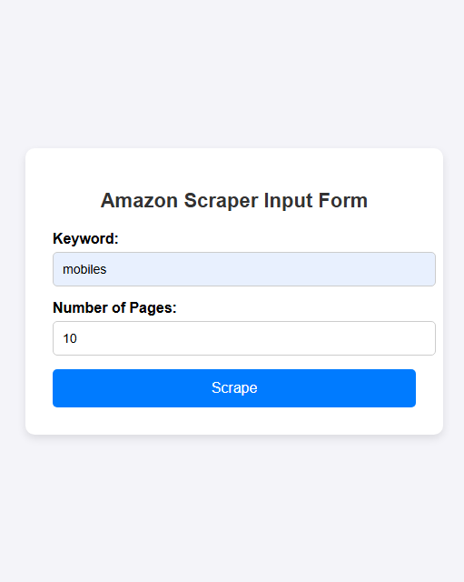
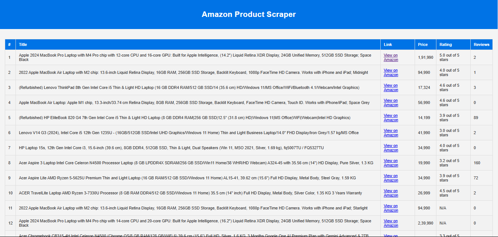
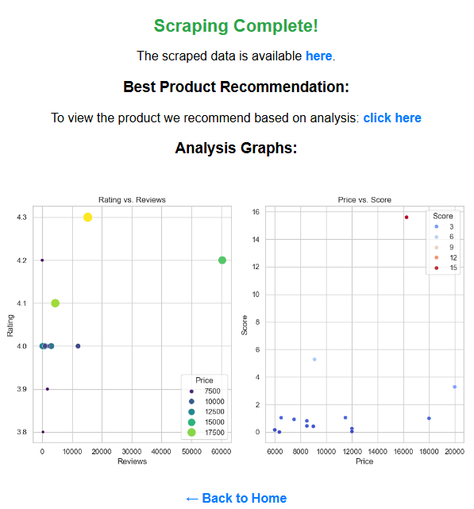

# 📦 Amazon Web Scraping and Analysis Project  

## 📌 Overview  
This project is a **Python-based Amazon web scraper** that extracts product details like **title, price, rating, reviews, and links** based on user input. The data is then analyzed to **recommend the best product** using numerical analysis and visualization techniques.  

## 🚀 Features  
- ✅ Scrapes product data from Amazon using **BeautifulSoup** and **requests**  
- ✅ Allows users to **input search keywords** and **number of pages** to scrape  
- ✅ Performs **data analysis** on extracted product data (Price, Rating, Reviews)  
- ✅ Uses **Seaborn & Matplotlib** for visualization  
- ✅ Recommends the **best product** based on a calculated score  

## 📁 Project Structure  
```bash
amazon-scraper/
│── amazon_scraper.py       # Web scraper script  
│── form_server.py          # Flask server for user input  
│── templates/  
│   ├── index.html          # Web form UI  
│── static/  
│   ├── style.css           # Styling for web pages  
│── amazon_products.csv     # Scraped data (Generated)  
│── README.md               # Project Documentation  
│── requirements.txt        # Dependencies  
```

## 🛠️ Technologies Used  
- **Python** (BeautifulSoup, requests, pandas)  
- **Flask** (for the web interface)  
- **Matplotlib & Seaborn** (for data visualization)  
- **GitHub** (for version control)  

## 🎯 How It Works  
1. **Run the Flask server** → Opens a webpage to enter a search keyword & number of pages  
2. **Scrapes Amazon** → Extracts product details and saves them in a CSV file  
3. **Performs Data Analysis** → Determines the best product using a score metric  
4. **Displays Results** → Shows analysis graphs and the best product link  

## 📌 Installation & Usage  

### 🔹 Prerequisites  
Ensure you have **Python 3+** and install dependencies:  
```bash
pip install -r requirements.txt
```
## 🚀 Running the Project  

### 🔹 Step 1: Start the Flask Server  
Run the following command in your terminal:  
```bash
python form_server.py
```
### 🔹 Step 2: Open the Web Interface  
1. Open your browser and go to:  
```bash
http://localhost:5000
```
2. Enter the **search keyword** (e.g., "laptop") and the **number of pages** to scrape. 



3. Click the **"Scrape"** button to start the process.  
4. The scraper will extract product details and save them in a **CSV file**.  


5. Once completed, the page will display:  
- ✅ A **link to the scraped data**  
- 📊 **Visualizations of the analysis**  
- 🏆 A **link to the best-recommended product**



## 📊 Data Analysis & Visualization  

### 🔹 Scatter Plot: Rating vs. Reviews  
- **X-axis**: Number of Reviews  
- **Y-axis**: Rating  
- **Bubble Size**: Product Price  
- **Purpose**: Shows the relationship between customer ratings and the number of reviews.  

### 🔹 Scatter Plot: Price vs. Score  
- **X-axis**: Price  
- **Y-axis**: Score (Calculated as (Rating * Reviews) / Price)  
- **Color Gradient**: Score Intensity  
- **Purpose**: Identifies the most cost-effective product based on rating and popularity.  

### 🏆 Best Product Selection Criteria  
- The best product is determined using the formula:  
  ```math
  Score = (Rating * Reviews) / Price
  ```
- The product with the highest score is recommended.
### 📌 Visualization Output
- The analysis graphs are generated using Matplotlib & Seaborn.
- The graphs are displayed on the results page along with the best product link.
## 💡 Future Improvements
- ✅ Implement Scrapy for faster scraping
- ✅ Enhance error handling for blocked requests
- ✅ Deploy on cloud (Heroku/AWS) for remote access
## 📜 License
This project is for educational purposes only. Amazon does not allow automated scraping, so use it responsibly.
